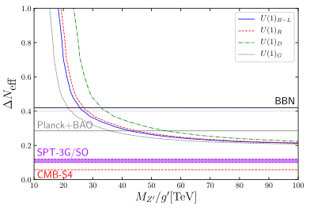

# Cosmological constraints for effective number of Dirac light neutrinos

Code repository for the paper
**Dirac neutrino mass generation from Majorana messenger**
by Julian Calle, Diego Restrepo, Óscar Zapata.

## Abstract

The radiative type-I seesaw has been already implemented to explain the lightness of Majorana neutrinos with both Majorana and Dirac heavy fermions, and the lightness of Dirac    neutrinos with                   Dirac heavy fermions. In this work we present a minimal implementation of the radiative type-I seesaw with light Dirac neutrinos and heavy Majorana fermions. An inert doublet and a complex singlet scalar complete the dark sector which is protected by an Abelian fermiophobic gauge symmetry that also forbids tree level mass contributions for the full set of light neutrinos. A fermion vector-like extension of the model is also proposed where the light right-handed neutrinos can thermalize in the primordial plasma and the extra gauge boson can be directly produced at colliders.
In particular, the  current upper bound on Δ<i>N</i>eff reported by PLANCK points to large ratios <it>MZ'/g'</it>≳ 40 TeV which can be competitive with collider constraint for <it>g'</it> sufficiently large in the ballpark of the Standard Model values, while future cosmic microwave background experiments may probe all the no minimal models presented here.

## Results

<!-- In [figures/](figures/) we collect the figures shown in the paper. The folder also contains a few additional plots and
animations: -->

- [D_Neff.pdf](figures/D_Neff.pdf) Contribution to the number of extra relativistic degrees of freedom (Δ<i>N</i>eff) in function of <it>MZ'/g'</it>.

## Code

The dependencies are just the standard Python `Scipy` tools with `numpy`, `matplotlib` and `pandas`

The code is contained inside the Jupyter notebook

- [DiracMajorana.ipynb](DiracMajorana.ipynb)

## References

If you use this code, please cite our paper [BibTeX](https://inspirehep.net/record/1755250/export/hx)

---
Based in template for https://github.com/smsharma/mining-for-substructure-lens
